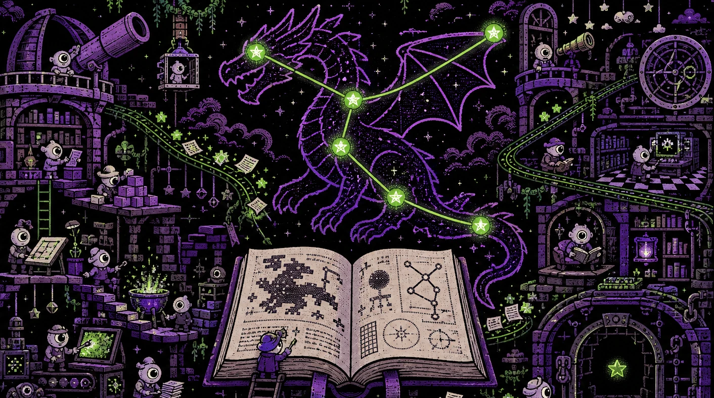
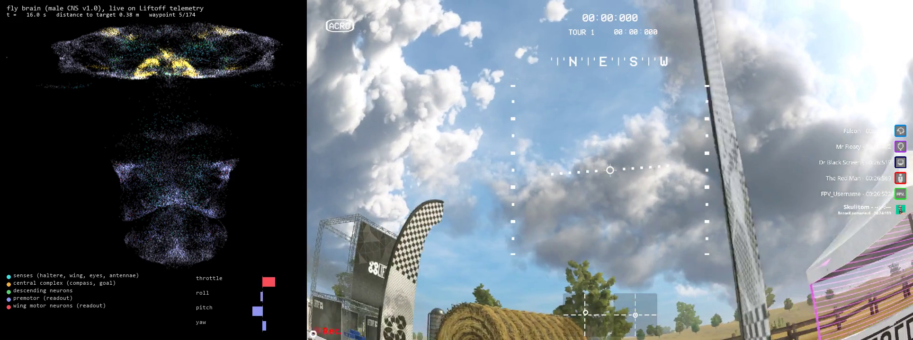
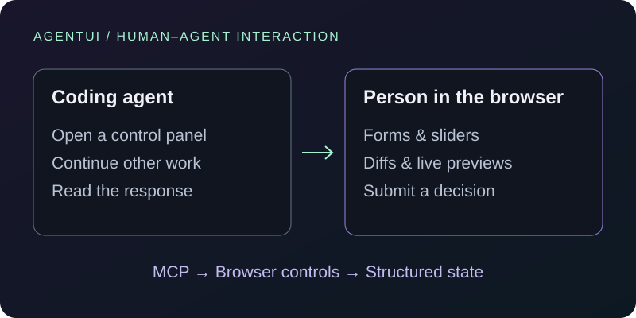
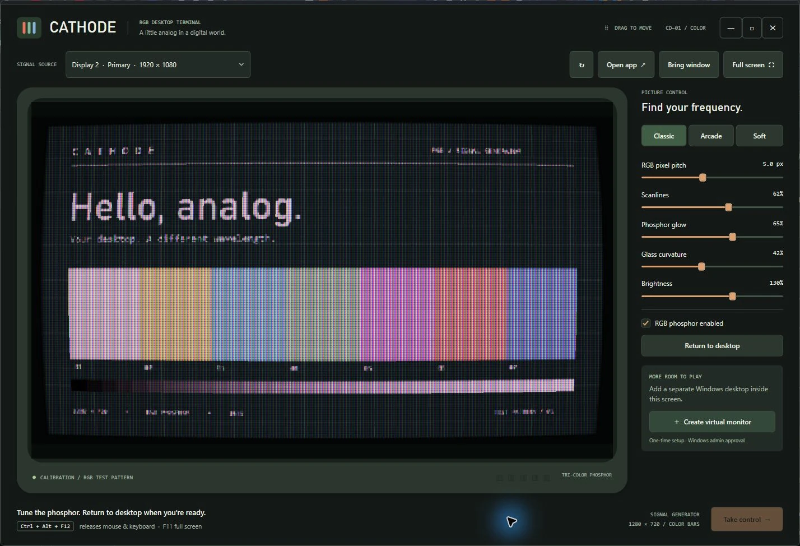

<picture>
  <source media="(max-width: 600px)" srcset="assets/v2/hello-mobile.svg">
  
</picture>

I'm a **backend and infrastructure engineer at SimCorp**, based in London. I design and operate distributed calculation infrastructure, from worker coordination and batch scheduling to the data layer and failure investigation.

Previously: **Eigen Technologies · JPMorgan · founder of an education startup.** MEng Computer Science, **UCL**, specialising in AI.

**[LitHarness](https://github.com/skulitom/LitHarness) is my main independent project**, exploring long-running agent workflows and persistent state. My other projects include agent execution environments and learned control systems. I use coding agents throughout development, set the architecture and constraints, and review and verify their work.

**[Portfolio & projects →](https://skulitom.github.io/) · [All repositories](https://github.com/skulitom?tab=repositories)**

## Selected projects

<table>
<tr>
<td width="50%" valign="top">

<h3><a href="https://github.com/skulitom/LitHarness">LitHarness</a> · Main project</h3>

Specialised LLM agents coordinate serial fiction over persistent narrative state and immutable manuscript revisions. Working generation pipeline; literary-quality evaluation remains an open research problem.

<strong>Python · Agent orchestration · Persistent state</strong>

</td>
<td width="50%" valign="top">

<h3><a href="https://github.com/skulitom/Anode">Anode</a></h3>

A Windows child session for an agent, with its own pointer, focus, CLI, MCP controls, and virtual gamepad. Runs as the same user and can access the same files.

<strong>C# · .NET · Windows APIs · MCP</strong>

</td>
</tr>
<tr>
<td width="50%" valign="top">

<h3><a href="https://github.com/skulitom/haltere">Haltere</a></h3>

A connectome-constrained recurrent network trained to control a drone in Liftoff. The latest lap-following controller tracks a taught path at 1.5 m/s with 0.67 m mean error. Research prototype; racing speed remains limited.

<strong>PyTorch · Differentiable simulation · 30,000 neurons</strong> <a href="https://skulitom.github.io/#haltere">Watch the Liftoff flight →</a>

</td>
<td width="50%" valign="top">

<h3><a href="https://github.com/skulitom/AgentUI">AgentUI</a></h3>

An MCP server that lets coding agents ask for decisions through forms, sliders, diffs, and live previews. The agent can continue working while a person adjusts the controls.

<strong>TypeScript · React · MCP · WebSockets</strong>

</td>
</tr>
<tr>
<td width="50%" valign="top">

<h3><a href="https://github.com/skulitom/primordia">Primordia</a></h3>

An interactive GPU artificial-life laboratory: four simulation systems, 36 presets, and headless image and video export.

<strong>Rust · wgpu · WGSL</strong> <a href="https://skulitom.github.io/#primordia">Watch the simulations →</a>

</td>
<td width="50%" valign="top">

<h3><a href="https://github.com/skulitom/CathodeDisplay">Cathode</a></h3>

A CRT virtual monitor for real Windows applications, with GPU phosphor rendering, scanlines, and glow. Available as a self-contained Windows download.

<strong>C# · WPF · GPU shaders</strong> <a href="https://github.com/skulitom/CathodeDisplay/releases/latest">Download →</a>

</td>
</tr>
</table>

## Open-source contribution

**[AnyIO: fix imports with loaders that omit `__file__`](https://github.com/agronholm/anyio/pull/1323) — merged.** Fixed an import failure by extending the existing eager-import fallback, with a regression test that fails without the change.

## More to explore

**Interactive web apps:** [Export Atlas](https://skulitom.github.io/export-atlas/) · [London in minutes](https://skulitom.github.io/london-time-map/) · [Chinese Touch Typing](https://skulitom.github.io/chinese-touch-typing/) · [Chinese Radicals](https://skulitom.github.io/chinese-radicals/)

**Generative-model experiment:** [Latent Space Explorer](https://github.com/skulitom/Latent-Space-Explorer)

**Published Android apps:** [Greek Letters Quiz](https://play.google.com/store/apps/details?id=com.greekletters.quiz) · [Medieval Armor Quiz](https://play.google.com/store/apps/details?id=com.armourquiz.medieval) · [Roman Emperors Quiz](https://play.google.com/store/apps/details?id=com.romanemperor.quiz)

**Core toolkit:** Python · SQL · PostgreSQL · Docker · Linux. Project work also uses TypeScript, React, C#, Rust, and PyTorch.
