<picture>
  <source media="(max-width: 600px)" srcset="assets/v2/hello-mobile.svg">
  
</picture>

<a href="https://skulitom.github.io/"><picture><source media="(prefers-reduced-motion: reduce)" srcset="assets/links/v3/static/portfolio.svg"></picture></a>

I'm a **backend and infrastructure engineer at SimCorp**, based in London. I design and operate distributed calculation infrastructure, from worker coordination and batch scheduling to the data layer and failure investigation.

Previously: **Eigen Technologies · JPMorgan · founder of an education startup.** MEng Computer Science, **UCL**, specialising in AI.

**[LitHarness](https://github.com/skulitom/LitHarness) is my main independent project**, an AI system that plans, writes, and checks long-form fiction. My other projects help agents use computers and explore learned control systems. I use coding agents throughout development, set the architecture and constraints, and review and verify their work.

[All repositories](https://github.com/skulitom?tab=repositories) · [Connect on LinkedIn](https://www.linkedin.com/in/artem-skulimovskiy-7bb028118/)

## Selected projects

<table>
<tr>
<td width="50%" valign="top">
<a href="https://github.com/skulitom/LitHarness"><picture><source media="(max-width: 600px)" srcset="assets/v2/litharness-mobile.svg"></picture></a>
<h3><a href="https://github.com/skulitom/LitHarness">LitHarness</a> · Main project</h3>

Turns a story idea into a world, chapter plans, and a growing manuscript. Tracks continuity and saves every accepted revision. The generation pipeline works; literary-quality evaluation remains an open research problem.

<strong>Python · Agent orchestration · Persistent state</strong> <a href="https://skulitom.github.io/litharness.html">Walkthrough &amp; writing sample →</a>

</td>
<td width="50%" valign="top">
<a href="https://github.com/skulitom/Anode">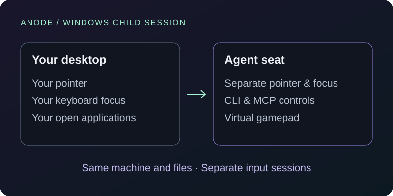</a>
<h3><a href="https://github.com/skulitom/Anode">Anode</a></h3>

Gives an AI agent its own Windows desktop while you keep using your PC. Includes separate input focus, automation controls, and a virtual gamepad. Runs as the same user with access to the same files.

<strong>C# · .NET · Windows APIs · MCP</strong>

</td>
</tr>
<tr>
<td width="50%" valign="top">
<a href="https://github.com/skulitom/haltere">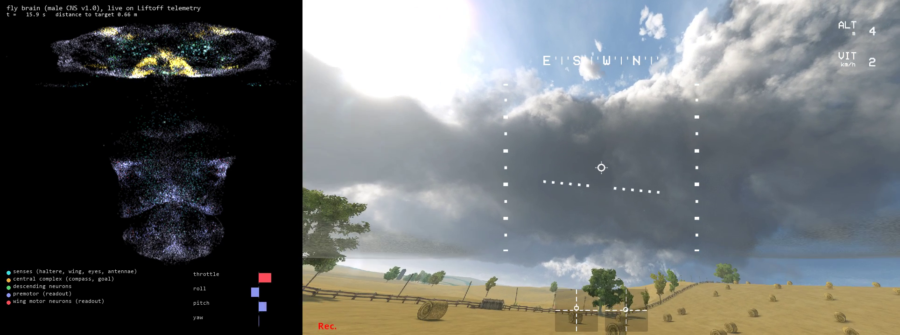</a>
<h3><a href="https://github.com/skulitom/haltere">Haltere</a></h3>

A 30,000-neuron connectome-constrained network for drone control in Liftoff. As of 22 September 2026, an experimental controller with visual race-cue assistance has completed three-lap races on two seen courses. Unseen-course completion remains unproven.

<strong>PyTorch · Differentiable simulation · 30,000 neurons</strong> <a href="https://skulitom.github.io/#haltere">Watch the Liftoff flight →</a> · <a href="https://github.com/skulitom/haltere#current-status">Current results</a>

</td>
<td width="50%" valign="top">
<a href="https://github.com/skulitom/AgentUI"><picture><source media="(max-width: 600px)" srcset="assets/v2/agentui-mobile.svg"></picture></a>
<h3><a href="https://github.com/skulitom/AgentUI">AgentUI</a></h3>

Guide a coding agent with forms, sliders, diffs, and live previews. The agent keeps working while you adjust the controls, then collects your decisions through MCP.

<strong>TypeScript · React · MCP · WebSockets</strong>

</td>
</tr>
<tr>
<td width="50%" valign="top">

<h3><a href="https://github.com/skulitom/primordia">Primordia</a></h3>

An interactive GPU artificial-life laboratory: five worlds, 42 presets, saved discoveries, live measurements, and headless image and video export. The new Symbiosis world couples agents and chemistry.

<strong>Rust · wgpu · WGSL</strong> <a href="https://skulitom.github.io/#primordia">Watch the simulations →</a>

</td>
<td width="50%" valign="top">
<a href="https://github.com/skulitom/CathodeDisplay"><picture><source media="(max-width: 600px)" srcset="assets/v2/cathode-mobile.svg"></picture></a>
<h3><a href="https://github.com/skulitom/CathodeDisplay">Cathode</a></h3>

A CRT virtual monitor for real Windows applications, with GPU phosphor rendering, scanlines, and glow. Available as a self-contained Windows download.

<strong>C# · WPF · GPU shaders</strong> <a href="https://github.com/skulitom/CathodeDisplay/releases/latest">Download →</a>

</td>
</tr>
</table>

## Interactive web apps

Explore maps, practise Chinese, and back up your song lists.

<a href="https://skulitom.github.io/MapLanguageVisualizer/"><picture><source media="(prefers-reduced-motion: reduce) and (max-width: 374px)" srcset="assets/links/v3/static/world-language-map-narrow.svg"><source media="(max-width: 374px)" srcset="assets/links/v3/world-language-map-narrow.svg"><source media="(prefers-reduced-motion: reduce)" srcset="assets/links/v3/static/world-language-map.svg"></picture></a>
<a href="https://skulitom.github.io/export-atlas/"><picture><source media="(prefers-reduced-motion: reduce) and (max-width: 374px)" srcset="assets/links/v3/static/export-atlas-narrow.svg"><source media="(max-width: 374px)" srcset="assets/links/v3/export-atlas-narrow.svg"><source media="(prefers-reduced-motion: reduce)" srcset="assets/links/v3/static/export-atlas.svg"></picture></a>
<a href="https://skulitom.github.io/london-time-map/"><picture><source media="(prefers-reduced-motion: reduce) and (max-width: 374px)" srcset="assets/links/v3/static/london-in-minutes-narrow.svg"><source media="(max-width: 374px)" srcset="assets/links/v3/london-in-minutes-narrow.svg"><source media="(prefers-reduced-motion: reduce)" srcset="assets/links/v3/static/london-in-minutes.svg"></picture></a>
<a href="https://skulitom.github.io/chinese-touch-typing/"><picture><source media="(prefers-reduced-motion: reduce) and (max-width: 374px)" srcset="assets/links/v3/static/chinese-touch-typing-narrow.svg"><source media="(max-width: 374px)" srcset="assets/links/v3/chinese-touch-typing-narrow.svg"><source media="(prefers-reduced-motion: reduce)" srcset="assets/links/v3/static/chinese-touch-typing.svg"></picture></a>
<a href="https://skulitom.github.io/chinese-radicals/"><picture><source media="(prefers-reduced-motion: reduce) and (max-width: 374px)" srcset="assets/links/v3/static/chinese-radicals-narrow.svg"><source media="(max-width: 374px)" srcset="assets/links/v3/chinese-radicals-narrow.svg"><source media="(prefers-reduced-motion: reduce)" srcset="assets/links/v3/static/chinese-radicals.svg"></picture></a>
<a href="https://skulitom.github.io/spotify-library-vault/"><picture><source media="(prefers-reduced-motion: reduce) and (max-width: 374px)" srcset="assets/links/v3/static/keepsake-narrow.svg"><source media="(max-width: 374px)" srcset="assets/links/v3/keepsake-narrow.svg"><source media="(prefers-reduced-motion: reduce)" srcset="assets/links/v3/static/keepsake.svg"></picture></a>

Earlier experiments

[Latent Space Explorer](https://github.com/skulitom/Latent-Space-Explorer) — an experiment in steering generative images through semantic directions.

## Android apps

I also publish educational quiz apps on Google Play, covering language and history.

<a href="https://play.google.com/store/apps/details?id=com.greekletters.quiz"><picture><source media="(max-width: 600px)" srcset="assets/v2/app-greek-mobile.svg"></picture></a>

<a href="https://play.google.com/store/apps/details?id=com.armourquiz.medieval"><picture><source media="(max-width: 600px)" srcset="assets/v2/app-armour-mobile.svg"></picture></a>

<a href="https://play.google.com/store/apps/details?id=com.romanemperor.quiz"><picture><source media="(max-width: 600px)" srcset="assets/v2/app-roman-mobile.svg"></picture></a>

[View my Google Play developer page →](https://play.google.com/store/apps/developer?id=Skulitom)

## Technical toolkit

<strong>AI &amp; agent tooling</strong>

  
  
  
  

<strong>Languages &amp; interfaces</strong>

  
  
  
  

<strong>Systems &amp; data</strong>

  
  
  
  

 

