<picture>
  <source media="(max-width: 600px)" srcset="assets/hello-mobile.svg">
  
</picture>

I'm a software engineer in London. I build Python backends and distributed systems, and follow curious ideas into AI agents, generative art, and the occasional retro display.

My current rabbit hole: **long-running agents, persistent state, and figuring out whether the thing we built actually works.**

## On my workbench

<table>
  <tr>
    <td width="50%">
      <a href="https://github.com/skulitom/LitHarness"><picture><source media="(max-width: 600px)" srcset="assets/litharness-mobile.svg"></picture></a>
    </td>
    <td width="50%">
      <a href="https://github.com/skulitom/Latent-Space-Explorer"><picture><source media="(max-width: 600px)" srcset="assets/latent-space-mobile.svg"></picture></a>
    </td>
  </tr>
  <tr>
    <td width="50%">
      <a href="https://github.com/skulitom/CathodeDisplay"><picture><source media="(max-width: 600px)" srcset="assets/cathode-mobile.svg"></picture></a>
    </td>
    <td width="50%">
      <a href="https://skulitom.github.io/london-time-map/"><picture><source media="(max-width: 600px)" srcset="assets/london-mobile.svg"></picture></a>
    </td>
  </tr>
</table>

[Browse all my repositories →](https://github.com/skulitom?tab=repositories)

## My usual toolkit

**Systems & data** &nbsp; `Python` `SQL` `PostgreSQL` `Docker` `Linux` `Bash`

**Experiments & interfaces** &nbsp; `PyTorch` `NumPy` `TypeScript` `React`

  
A little more about me

   

I work on backend and infrastructure engineering at SimCorp, with a background in quantitative computing. Previously: Eigen Technologies, an education startup I founded, and JPMorgan.

I studied Computer Science at UCL, specialising in AI. I like projects that join solid engineering to something you can explore, play with, or make things with.

 

