<picture>
  <source media="(max-width: 600px)" srcset="assets/v2/hello-mobile.svg">
  
</picture>

I'm a London-based software engineer focused on Python, backend infrastructure, and distributed systems. My experience spans production compute platforms, data engineering, and quantitative development.

My current interests include **LLM agent orchestration, persistent state, and evaluation methods for complex systems.**

## Engineering with AI agents

I use AI coding agents throughout development, from planning and implementation to debugging and testing. I set the technical direction, coordinate the work, and validate results through review and reproducible checks.

## Selected projects

<table>
  <tr>
    <td width="50%">
      <a href="https://github.com/skulitom/LitHarness"><picture><source media="(max-width: 600px)" srcset="assets/v2/litharness-mobile.svg"></picture></a>
    </td>
    <td width="50%">
      <a href="https://github.com/skulitom/Latent-Space-Explorer"><picture><source media="(max-width: 600px)" srcset="assets/v2/latent-space-mobile.svg"></picture></a>
    </td>
  </tr>
  <tr>
    <td width="50%">
      <a href="https://github.com/skulitom/CathodeDisplay"><picture><source media="(max-width: 600px)" srcset="assets/v2/cathode-mobile.svg"></picture></a>
    </td>
    <td width="50%">
      <a href="https://skulitom.github.io/london-time-map/"><picture><source media="(max-width: 600px)" srcset="assets/v2/london-mobile.svg"></picture></a>
    </td>
  </tr>
  <tr>
    <td width="50%">
      <a href="https://skulitom.github.io/export-atlas/"><picture><source media="(max-width: 600px)" srcset="assets/v2/export-atlas-mobile.svg"></picture></a>
    </td>
    <td width="50%">
      <a href="https://github.com/skulitom/AgentUI"><picture><source media="(max-width: 600px)" srcset="assets/v2/agentui-mobile.svg"></picture></a>
    </td>
  </tr>
</table>

[Browse all my repositories →](https://github.com/skulitom?tab=repositories)

## Android apps

I also publish educational quiz apps on Google Play, covering language and history.

<a href="https://play.google.com/store/apps/details?id=com.greekletters.quiz"><picture><source media="(max-width: 600px)" srcset="assets/v2/app-greek-mobile.svg"></picture></a>

<a href="https://play.google.com/store/apps/details?id=com.armourquiz.medieval"><picture><source media="(max-width: 600px)" srcset="assets/v2/app-armour-mobile.svg"></picture></a>

<a href="https://play.google.com/store/apps/details?id=com.romanemperor.quiz"><picture><source media="(max-width: 600px)" srcset="assets/v2/app-roman-mobile.svg"></picture></a>

[View my Google Play developer page →](https://play.google.com/store/apps/developer?id=Skulitom)

## Technical toolkit

<strong>AI &amp; agent tooling</strong>

  
  
  
  

<strong>Languages &amp; interfaces</strong>

  
  
  
  

<strong>Systems &amp; data</strong>

  
  
  
  

  
Professional background

   

I work on backend and infrastructure engineering at SimCorp, with a background in quantitative computing. Previously: Eigen Technologies, an education startup I founded, and JPMorgan.

I hold an MEng in Computer Science from UCL, where I specialised in AI. My projects apply that background to agent systems, generative models, and interactive applications.

 

